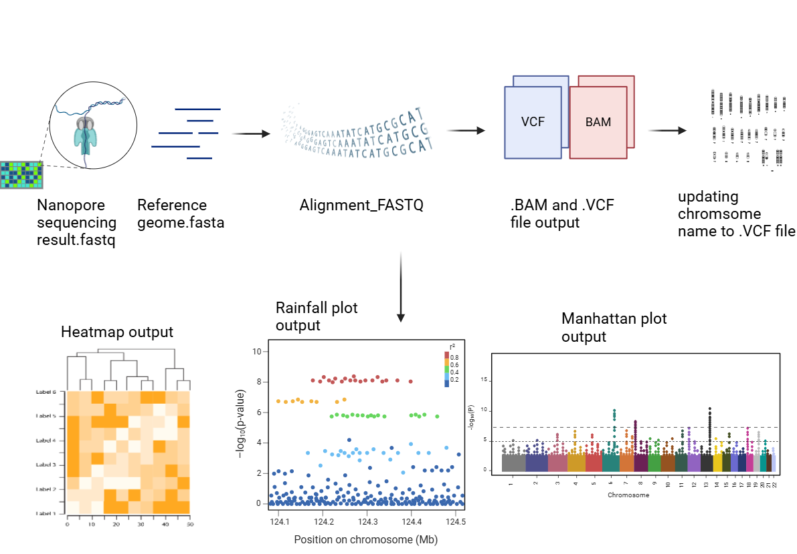
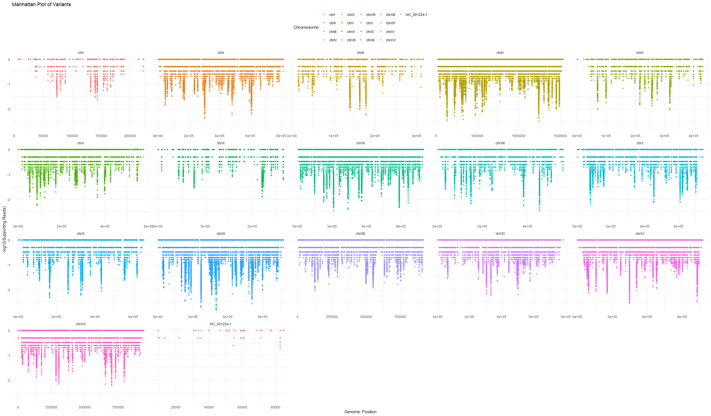

<!-- README.md is generated from README.Rmd. Please edit that file -->

```{r, include = FALSE}
knitr::opts_chunk$set(
  collapse = TRUE,
  comment = "#>",
  fig.path = "man/figures/README-",
  out.width = "100%"
)
```

# LegitXMut

<!-- badges: start -->
<!-- badges: end -->
An R Package Designed For Mutation Analysis Directly From FASTQ file to Visualization.

# Description
`LegitXMut` is an R package designed for the analysis of genetic variants, specifically designed for workflows that handle Nanopore sequencing data. 
The workflow of the package involves aligning sequencing reads, updating chromosome names in VCF files, and visualizing mutation data, which enhance the efficiency and 
accessibility of mutation analysis in bioinformatics pipelines. `LegitXMut` integrates with widely used bioinformatics tools like `Rsubread`, `VariantAnnotation`, `GenomicAlignments`, 
and others, to help users to perform end-to-end genomic variant analysis within `ONE PACKAGE` and `THREE FUNCTIONS`.

This package fills a gap in bioinformatics workflows by allowing direct handling of FASTQ, and VCF files for visualization of mutations, which can aid in exploratory data analysis 
and the interpretation of mutation patterns across various chromosomes. Unlike many existing tools, `LegitXMut` is uniquely focused on a complete solution from alignment to visualization in `R language`, 
offering functions for generating compelling graphical outputs such as `heatmaps`, `rainfall plots`, and `manhattan plots` to illustrate mutation distributions and result confidences.
The `LegitXMut` package was developed using `R version 4.4.1 (June, 2024)`, Platform: `x86_64-w64-mingw32/x64 (64-bit)`, running under `Windows 11`.

# Installation

```{r Installation}
# Install devtools if you haven't already
install.packages("devtools")
library("devtools")

# Install LegitXMut from GitHub with vignettes
devtools::install_github("<ZhenghaoXiao>/LegitXMut", build_vignettes = TRUE)
library("LegitXMut")
```

# Example
```{r Example}
#Align a FASTQ file to a reference genome with custom parameters.
mutateddemoalignment <- alignment_FASTQ(fastqPath =  "~/LegitXMut/inst/extdata/SRR29917898.fastq",
referencePath =  "~/LegitXMut/inst/extdata/yeast.fna",
outputBAM =  "~/LegitXMut/inst/extdata/aligned_output.bam")

#Update chromosome names in a VCF file using a reference FASTA file/FNA file
updatingvcf <- update_vcf(
 fastaPath = "~/LegitXMut/inst/extdata/yeast.fna",
 vcfPath = "~/LegitXMut/inst/extdata/aligned_output.bam.indel.vcf",
 outputVcfPath = "~/LegitXMut/inst/extdata/updated.vcf"
 )
#Generate a heatmap of variants' frequency across chromosomes
plot_vcf_mutation_data(
vcfPath = "~/LegitXMut/inst/extdata/updated.vcf",
plotType = "heatmap",
title = "Heatmap of Mutations in SRR29917898 of Yeast Genome",
font_size = 12,
xlab = "Chromosome",
ylab = "Mutation Frequency",
legend_position = "bottom"
)
#Generate a rainfall plot of mutations across chromosomes with customized colors
plot_vcf_mutation_data(
vcfPath = "~/LegitXMut/inst/extdata/updated.vcf",
plotType = "rainfall",
title = "Rainfall Plot of Mutations",
color_scheme = c("C>A" = "red", "C>G" = "orange", "C>T" = "green",
                    "T>A" = "yellow", "T>C" = "blue", "T>G" = "purple",
                    "indel" = "grey"),
alpha = 0.7,
font_size = 10,
xlab = "Genomic Position",
ylab = "Inter-Variant Distance (log10)",
legend_position = "right"
)
#Generate a manhattan plot for mutations with modified y-axis label
plot_vcf_mutation_data(
vcfPath = "~/LegitXMut/inst/extdata/updated.vcf",
plotType = "manhattan",
title = "Manhattan Plot of Variants",
ylab = "-log10(Supporting Reads)",
xlab = "Genomic Position",
font_size = 11,
alpha = 0.6,
legend_position = "top"
)
```
# Overview
The overview of the package:

```{r example}
ls("package:LegitXMut")
data(package = "LegitXMut") 
browseVignettes("LegitXMut")
```

`LegitXMut` provides the following functions for now: 
- `alignment_FASTQ`:This function creates a `BAM` file and calls variants by aligning a `FASTQ` file to a provided reference genome in `FASTA` format. 
It allows the setting of maximal indel and mismatch criteria for quality control and optimization. The result `.VCF` file should be input into `update_vcf`
and `plot_vcf_mutation_data` later on.
-`update_vcf`:This tool updates the chromosome names in a `VCF` file by extracting chromosomal mappings from a reference genome in `FASTA` format. 
It ensures the workflows that demand multiple chromosome and whole genome analysis by producing a modified `VCF` file with standardized chromosome names.
-`plot_vcf_mutation_data`:This function takes the VCF file generated from update_vcf or users can input external file and uses it to create different mutation visualization graphs. 
The three graphic types that users can select from—"heatmap," "manhattan," and "rainfall"—each offers distinct viewpoints on mutation data, including inter-variant distances,
confidences of the result, and mutation density across chromosomes.


Heatmap demo

Manhatten plot demo

Rainfall plot demo


You'll still need to render `README.Rmd` regularly, to keep `README.md` up-to-date. `devtools::build_readme()` is handy for this.

You can also embed plots, for example:

```{r pressure, echo = FALSE}
plot(pressure)
```

In that case, don't forget to commit and push the resulting figure files, so they display on GitHub and CRAN.
