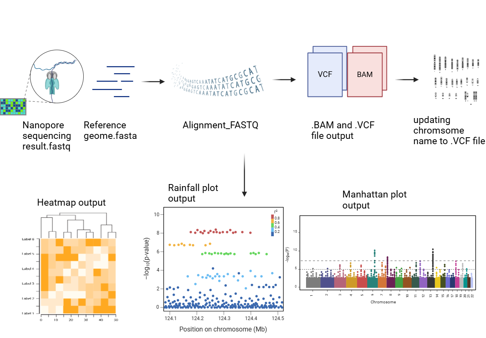
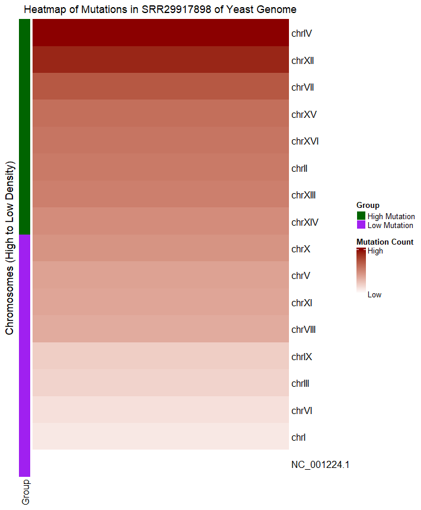
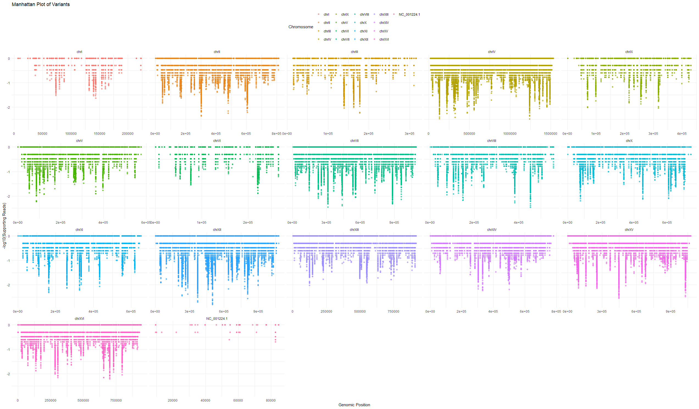
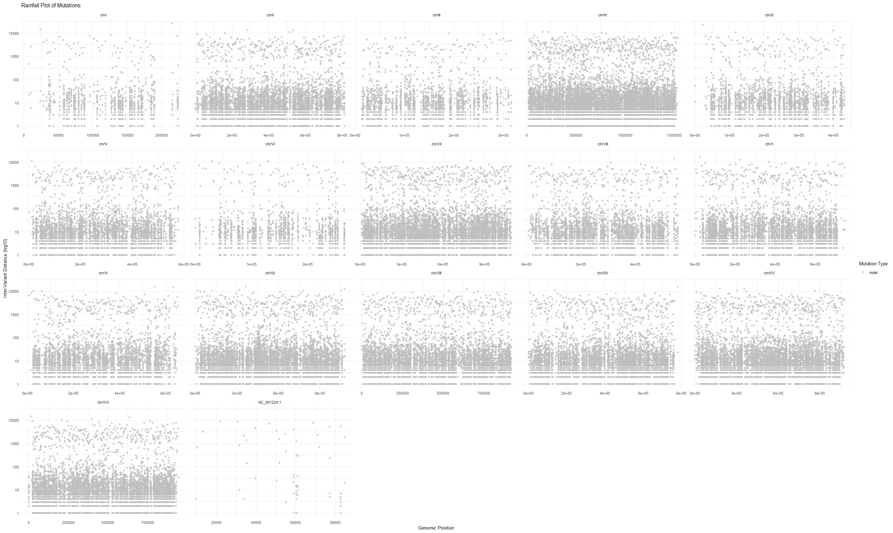

<!-- README.md is generated from README.Rmd. Please edit that file -->

# LegitXMut

<!-- badges: start -->
<!-- badges: end -->

An R Package Designed For Mutation Analysis Directly From FASTQ file to
Visualization.

# Description

`LegitXMut` is an R package designed for the analysis of genetic
variants, specifically designed for workflows that handle Nanopore
sequencing data. The workflow of the package involves aligning
sequencing reads, updating chromosome names in VCF files, and
visualizing mutation data, which enhance the efficiency and
accessibility of mutation analysis in bioinformatics pipelines.
`LegitXMut` integrates with widely used bioinformatics tools like
`Rsubread`, `VariantAnnotation`, `GenomicAlignments`, and others, to
help users to perform end-to-end genomic variant analysis within
`ONE PACKAGE` and `THREE FUNCTIONS`. Users have to change the
`file paths` to `local paths` for `tests` and `usage`.

This package fills a gap in bioinformatics workflows by allowing direct
handling of FASTQ, and VCF files for visualization of mutations, which
can aid in exploratory data analysis and the interpretation of mutation
patterns across various chromosomes. Unlike many existing tools,
`LegitXMut` is uniquely focused on a complete solution from alignment to
visualization in `R language`, offering functions for generating
compelling graphical outputs such as `heatmaps`, `rainfall plots`, and
`manhattan plots` to illustrate mutation distributions and result
confidences. The `LegitXMut` package was developed using
`R version 4.4.1 (June, 2024)`, Platform:
`x86_64-w64-mingw32/x64 (64-bit)`, running under `Windows 11`.

# Installation

``` r
# Install devtools if needed
install.packages("devtools")
library(devtools)

# Install LegitXMut from GitHub with vignettes
devtools::install_github("ZhenghaoXiao/LegitXMut", build_vignettes = TRUE)
library(LegitXMut)
```

# Examples

``` r
#Users Have to Change The File Paths to Local File Paths
#For TESTS AND USAGE

#Align a FASTQ file to a reference genome with custom parameters.
mutateddemoalignment <- alignment_FASTQ(fastqPath =  "~/LegitXMut/inst/extdata/SRR29917898.fastq",
referencePath =  "~/LegitXMut/inst/extdata/yeast.fna",
outputBAM =  "~/LegitXMut/inst/extdata/aligned_output.bam")

#Update chromosome names in a VCF file using a reference FASTA file/FNA file
updatingvcf <- update_vcf(
 fastaPath = "~/LegitXMut/inst/extdata/yeast.fna",
 vcfPath = "~/LegitXMut/inst/extdata/aligned_output.bam.indel.vcf",
 outputVcfPath = "~/LegitXMut/inst/extdata/updated.vcf"
 )
#Generate a heatmap of variants' frequency across chromosomes
plot_vcf_mutation_data(
vcfPath = "~/LegitXMut/inst/extdata/updated.vcf",
plotType = "heatmap",
title = "Heatmap of Mutations in SRR29917898 of Yeast Genome",
font_size = 12,
xlab = "Chromosome",
ylab = "Mutation Frequency",
legend_position = "bottom"
)
#Generate a rainfall plot of mutations across chromosomes with customized colors
#Demo data only have insertion-deletion variants of more than one nucleotides, so only indel will be visualized
plot_vcf_mutation_data(
vcfPath = "~/LegitXMut/inst/extdata/updated.vcf",
plotType = "rainfall",
title = "Rainfall Plot of Mutations",
color_scheme = c("C>A" = "red", "C>G" = "orange", "C>T" = "green",
                    "T>A" = "yellow", "T>C" = "blue", "T>G" = "purple",
                    "indel" = "grey"),
alpha = 0.7,
font_size = 10,
xlab = "Genomic Position",
ylab = "Inter-Variant Distance (log10)",
legend_position = "right"
)
#Generate a manhattan plot for mutations with modified y-axis label
plot_vcf_mutation_data(
vcfPath = "~/LegitXMut/inst/extdata/updated.vcf",
plotType = "manhattan",
title = "Manhattan Plot of Variants",
ylab = "-log10(Supporting Reads)",
xlab = "Genomic Position",
font_size = 11,
alpha = 0.6,
legend_position = "top"
)
```

# Overview

The overview of the package:

``` r
ls("package:LegitXMut")
data(package = "LegitXMut") 
browseVignettes("LegitXMut")
```

`LegitXMut` provides the following functions for now: -
`alignment_FASTQ`:This function creates a `BAM` file and calls variants
by aligning a `FASTQ` file to a provided reference genome in `FASTA`
format. It allows the setting of maximal indel and mismatch criteria for
quality control and optimization. The result `.VCF` file should be input
into `update_vcf` and `plot_vcf_mutation_data` later on.

\-`update_vcf`:This tool updates the chromosome names in a `VCF` file by
extracting chromosomal mappings from a reference genome in `FASTA`
format. It ensures the workflows that demand multiple chromosome and
whole genome analysis by producing a modified `VCF` file with
standardized chromosome names.

\-`plot_vcf_mutation_data`:This function takes the VCF file generated
from update_vcf or users can input external file and uses it to create
different mutation visualization graphs. The three graphic types that
users can select from—“heatmap,” “manhattan,” and “rainfall”—each offers
distinct viewpoints on mutation data, including inter-variant distances,
confidences of the result, and mutation density across chromosomes.









# Contributions

The author of `LegitXMut` is `Zhenghao Xiao`. The package provides three
functions to analyze genetic variation by allowing users to align
sequence reads, standardize chromosome names, and visualize mutation
patterns in one package.

`alignment_FASTQ()`: `Rsubread` and `GenomicAlignments` was employed to
align a FASTQ file to a reference genome, generating BAM and VCF files
while allowing quality control through configurable parameters for
`indels` and `mismatches`.OpenAI was used for debugging suggestions and
potential function suggestions only.

`update_vcf()`: This function utilizes `VariantAnnotation`, `stringr`
and `GenomeInfoDb` to update chromosome names in VCF files according to
a reference genome fasta file, the updated file will used for
visualizations.OpenAI was used for debugging suggestions and potential
function suggestions only..

`plot_vcf_mutation_data()`: This function was requires
`VariantAnnotation`, `GenomicRanges`, `ggplot2`, `ComplexHeatmap`,
`SummarizedExperiment`, `dplyr`, `stats`, and `circlize`. Using a
variety of plot patterns (“heatmap,” “manhattan,” and “rainfall”), this
tool visualizes mutation data from VCF files to help with understanding
chromosome-to-chromosome inter-variant distances, mutation frequency
density, and distribution.OpenAI was used for debugging suggestions and
potential function suggestions only.

# References

1.Gu, Z. et al. “circlize Implements and Enhances Circular Visualization
in R.” Bioinformatics, vol. 30, no. 19, 2014, pp. 2811–2812.
<doi:10.1093/bioinformatics/btu393>.

2.Gu, Zuguang, Roland Eils, and Matthias Schlesner. “Complex Heatmaps
Reveal Patterns and Correlations in Multidimensional Genomic Data.”
Bioinformatics, vol. 32, no. 18, 2016, pp. 2847–2849.
<https://doi.org/10.1093/bioinformatics/btw313>.

3.Lawrence, Michael, et al. “Software for Computing and Annotating
Genomic Ranges.” PLoS Computational Biology, vol. 9, no. 8, 2013,
e1003118. <https://doi.org/10.1371/journal.pcbi.1003118>.

4.Liao, Y., Gordon K. Smyth, and Wei Shi. “The R Package Rsubread is
Easier, Faster, Cheaper and Better for Alignment and Quantification of
RNA Sequencing Reads.” Nucleic Acids Research, vol. 47, no. 8, 2019,
e47. <doi:10.1093/nar/gkz114>. Available at:
<https://academic.oup.com/nar/article/47/8/e47/5371636>.

5.Morgan, M., P. Aboyoun, R. Gentleman, M. Lawrence, and H. Pages.
“GenomicAlignments: Efficient Alignments Processing in R for NGS Data.”
Bioconductor, 2019, <doi:10.18129/B9.bioc.GenomicAlignments>. Available
at:
<https://bioconductor.org/packages/release/bioc/html/GenomicAlignments.html>.

6.Morgan, Martin, Vincent Obenchain, James Hester, and Hervé Pagès.
SummarizedExperiment: Summarized Experiment Container. R package version
1.28.0, Bioconductor, 2022,
<https://bioconductor.org/packages/SummarizedExperiment>.

7.National Center for Biotechnology Information (NCBI). Saccharomyces
cerevisiae S288C Genome Assembly (GCF_000146045.2). NCBI Datasets,
<https://www.ncbi.nlm.nih.gov/datasets/genome/GCF_000146045.2/>.
Accessed 4 Nov. 2024.

8.National Center for Biotechnology Information (NCBI). Sequence Read
Archive (SRA) Run: SRR29917898. NCBI SRA,
<https://trace.ncbi.nlm.nih.gov/Traces/?view=run_browser&acc=SRR29917898&display=download>.
Accessed 4 Nov. 2024.

9.OpenAI. ChatGPT: Assistance with R Function Development for
Bioinformatics Applications, “LegitxMut”. <https://chat.openai.com>.
Accessed 5 Nov. 2024.

10.Pagès, Hervé, Patrick Aboyoun, S. DebRoy, and Michael Lawrence.
GenomeInfoDb: Utilities for Manipulating Chromosome Names, Including
Modifying the Names to Follow a Particular Convention. R package version
1.36.0, Bioconductor, 2023,
<https://bioconductor.org/packages/GenomeInfoDb>.

11.R Core Team. R: A Language and Environment for Statistical Computing.
R Foundation for Statistical Computing, 2024, Vienna, Austria,
<https://www.R-project.org/>.

12.Silva, Anjali. TestingPackage. GitHub,
<https://github.com/anjalisilva/TestingPackage>. Accessed 5 Nov. 2024.

13.Wickham, Hadley. ggplot2: Elegant Graphics for Data Analysis.
Springer-Verlag, 2016, <https://ggplot2.tidyverse.org>.

14.Wickham, Hadley, et al. dplyr: A Grammar of Data Manipulation. R
package version 1.1.2, 2023, <https://CRAN.R-project.org/package=dplyr>.

15.Wickham, H. stringr: Simple, Consistent Wrappers for Common String
Operations. R package version 1.4.0, 2019,
<https://CRAN.R-project.org/package=stringr>.

# Acknowledgements

This package was developed as part of an assessment for 2024 BCB410H:
Applied Bioinformatics course at the University of Toronto, Toronto,
CANADA. <LegitXMut> welcomes issues, enhancement requests, and other
contributions. To submit an issue, use the GitHub issues.
