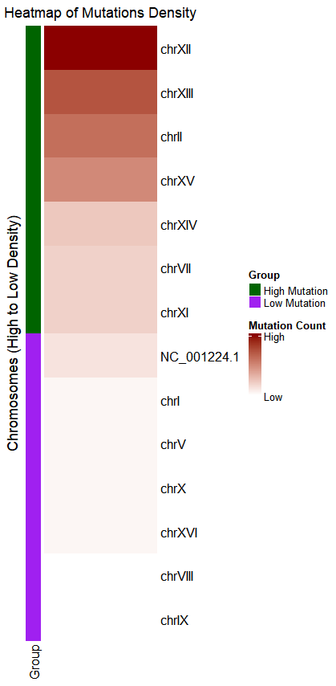
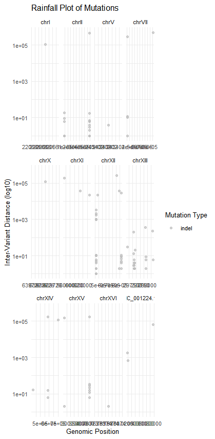
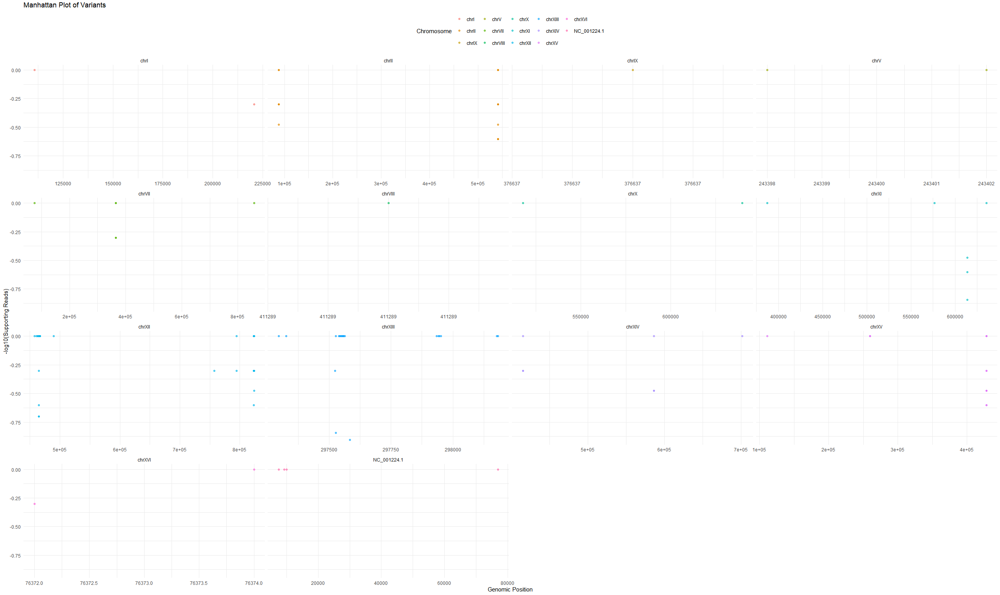

```{r, include = FALSE}
library(knitr)
opts_chunk$set(fig.align = "center", 
               out.width = "90%",
               fig.width = 6, fig.height = 5.5,
               dev.args=list(pointsize=10),
               par = TRUE, # needed for setting hook 
               collapse = TRUE, # collapse input & ouput code in chunks
               warning = FALSE)
knit_hooks$set(par = function(before, options, envir)
  { if(before && options$fig.show != "none") 
       par(family = "sans", mar=c(4.1,4.1,1.1,1.1), mgp=c(3,1,0), tcl=-0.5)
})
set.seed(1) # for exact reproducibility
```

## Introduction

LegitXMut is an R package developed to analyze and visualize mutation data directly from entry of FASTA and FASTQ files. 
It can create BAM and VCF files by aligning FASTQ files to a reference genome, update VCF chromosomal names based on a 
reference, and display mutation data in different plot styles.

To download **LegitXMut**, use the following commands:

```r
require("devtools")
devtools::install_github("ZhenghaoXiao/LegitXMut", build_vignettes = TRUE)
library("LegitXMut")
```
To list all sample functions available in the package:
``` r
ls("package:LegitXMut")
```

To list all sample datasets available in the package:
``` r
#Demo data of this package was downloaded from NCBI, as listed in the reference
#Users can access them in inst/exdata/
#ERR12205202.fastq: A FASTQ file containing sequencing reads.
#yeast.fna: A reference genome in FASTA format.
#aligned_output.bam: An example BAM file from an alignment.
#updated.vcf: A Variant Call Format (VCF) file with mutation data.
data(package = "LegitXMut")#will give no data
```
<br>


## Applications

**Aligning FASTQ to Reference Genome**

To create a BAM file, align a FASTQ file to a reference genome using the alignment_FASTQ function. 
This function supports for quality control during alignment by manipulating 
indels and maxMismatches parameters. More information about *alignment_FASTQ* function can be found using `?`
```{r, eval = FALSE}
# Load the LegitXMut package
library(LegitXMut)

# The sample data are stored in the inst/extdata/ directory of the package
fastqPath <- system.file("extdata", "ERR12205202.fastq", package = "LegitXMut")
referencePath <- system.file("extdata", "yeast.fna", package = "LegitXMut")

# Specify the output path
outputBAM <- file.path(system.file("extdata", package = "LegitXMut"), "aligned_output.bam")

# Run alignment
mutateddemoalignment <- alignment_FASTQ(
  fastqPath = fastqPath,
  referencePath = referencePath,
  indels = 10,
  maxMismatches = 1000,
  outputBAM = outputBAM
)
# See the result
View(mutateddemoalignment)
```
```{r, eval = FALSE}
#This produces a BAM file that includes the alignment information of the files and a VCF file 
#that can be used for visualization.Adjust parameters indels and maxMismatches for different datasets.
```
**Update Chromosome Names to VCF File**

The update_vcf function uses the reference FASTA file to update the chromosomal names in a VCF file.
```{r, eval = FALSE}
# Load the LegitXMut package
library(LegitXMut)

# Define paths
fastaPath <- system.file("extdata", "yeast.fna", package = "LegitXMut")
vcfPath <- system.file("extdata", "aligned_output.bam.indel.VCF", package = "LegitXMut")

# Use a writable location for the output VCF file
outputVcfPath <- file.path(system.file("extdata", package = "LegitXMut"), "updated.VCF")

# Update VCF chromosome names
updatedvcf <- update_vcf(fastaPath, vcfPath, outputVcfPath)
```

```{r, eval = FALSE}
#The VCF file now can reflect the chromosome names of each mutations
#Use this updated VCF for downstream analysis of visualization.
```
**Visualizing Mutation Data**

Input mutation data from a VCF file, plot_vcf_mutation_data creates various types of visualizations,
including heatmaps, Manhattan plots, and rainfall plots.
The workflow of this version of the package only supports the display of insertions and deletions(indel) mutation 
patterns due to the current implementation of the alignment function. 
However, the Manhattan plot visualization in this version can display single nucleotide polymorphisms(SNPs) 
when provided with appropriate input data.
```{r, eval = FALSE}
library(LegitXMut)
# Define path
vcfPath <- system.file("extdata", "updated.vcf", package = "LegitXMut")
#Plot with heatmap
plot_vcf_mutation_data(
  vcfPath = vcfPath,
  plotType = "heatmap",
  title = "Mutation Density Heatmap",
  font_size = 12,
  xlab = "Chromosome",
  ylab = "Mutation Frequency",
  legend_position = "bottom"
)
```
<div style="text-align:center">

**The heatmap visualizes mutation densities across chromosomes in the reference genome, with rows representing chromosomes sorted from high to low mutation density.**
**The highest mutation counts is indicated by the darkest red color, while the lowest mutation counts is visualized with lighter shades of red.**
**Grouping on the left shows "High Mutation" (green) and "Low Mutation" (purple) density categories based on the median mutation counts.**
**xlab, ylab, and legend position are fixed for heatmap**

<br>
```{r, eval = FALSE}
#Plot with rainfall plot
vcfPath <- system.file("extdata", "updated.vcf", package = "LegitXMut")
#Demo data only have insertion-deletion variants of more than one nucleotides changes
#Only indel will be visualized
plot_vcf_mutation_data(
  vcfPath = vcfPath,
  plotType = "rainfall",
  title = "Rainfall Plot of Mutations",
  color_scheme = c("C>A" = "red", "C>G" = "orange", "C>T" = "green",
                   "T>A" = "yellow", "T>C" = "blue", "T>G" = "purple",
                   "indel" = "grey"),
  alpha = 0.7,
  font_size = 10,
  xlab = "Genomic Position",
  ylab = "Inter-Variant Distance (log10)",
  legend_position = "right"
)
```
<div style="text-align:center">

**This plot demonstrates the distribution of mutations across chromosomes. Each dot represents a variant, with the x-axis indicating the genomic position and the y-axis showing the significance of the supporting reads, expressed as -log10(SR).**
**Chromosome-specific clustering of high-support mutations can highlight significant genomic regions, such as hotspots for variation and potential areas of biological interest in mutation studies.**
**Only indel will be visualized because the this alignment method only output indel into VCF**

<br>
```{r, eval = FALSE}
# Define path
vcfPath <- system.file("extdata", "updated.vcf", package = "LegitXMut")
# Plot the Manhattan plot using the updated VCF file
plot_vcf_mutation_data(
  vcfPath = vcfPath,
  plotType = "manhattan",
  title = "Manhattan Plot of Variants",
  ylab = "-log10(Supporting Reads)",
  xlab = "Genomic Position",
  font_size = 11,
  alpha = 0.6,
  legend_position = "top"
)
```
<div style="text-align:center">

**This plot represents the inter-variant distances (y-axis, log-transformed) as a function of genomic positions (x-axis) across chromosomes. Each dot represents a mutation.**
**Dense regions with shorter inter-variant distances can indicate mutation hotspots.**
**Sparse regions with long inter-variant distances could represent conserved genomic regions or low-coverage areas during sequencing.**
**Manhattan plots do not allow color modifications due to the potentially high number of chromosomes displayed**


<br>

## Package References

- "Xiao, Z. (2024) LegitXMut: A User-Friendly R Package for Nanopore Sequencing Mutation Analysis: Efficient, Accessible Workflows from FASTQ File Alignment to Visualizations.
   Unpublished. URL https://github.com/zhenghao/LegitXMut."

<br>

## Other References

1.BioRender. (2024). Image created by Zhenghao Xiao. Retrieved November 5, 2024, from https://app.biorender.com/

2.Chang, W., J. Cheng, J. Allaire, C. Sievert, B. Schloerke, Y. Xie, J. Allen, J. McPherson, A. Dipert, B. Borges (2024). shiny: Web Application Framework for R. R package version 1.9.1, https://CRAN.R-project.org/package=shiny

3.Gu, Z. et al. “circlize Implements and Enhances Circular Visualization in R.” Bioinformatics, vol. 30, no. 19, 2014, pp. 2811–2812. doi:10.1093/bioinformatics/btu393.

4.Gu, Zuguang, Roland Eils, and Matthias Schlesner. "Complex Heatmaps Reveal Patterns and Correlations in Multidimensional Genomic Data." Bioinformatics, vol. 32, no. 18, 2016, pp. 2847–2849. https://doi.org/10.1093/bioinformatics/btw313.

5.Lawrence, Michael, et al. "Software for Computing and Annotating Genomic Ranges." PLoS Computational Biology, vol. 9, no. 8, 2013, e1003118. https://doi.org/10.1371/journal.pcbi.1003118.

6.Liao, Y., Gordon K. Smyth, and Wei Shi. “The R Package Rsubread is Easier, Faster, Cheaper and Better for Alignment and Quantification of RNA Sequencing Reads.” Nucleic Acids Research, vol. 47, no. 8, 2019, e47. doi:10.1093/nar/gkz114. Available at: https://academic.oup.com/nar/article/47/8/e47/5371636.

7.Morgan, M., P. Aboyoun, R. Gentleman, M. Lawrence, and H. Pages. “GenomicAlignments: Efficient Alignments Processing in R for NGS Data.” Bioconductor, 2019, doi:10.18129/B9.bioc.GenomicAlignments. Available at: https://bioconductor.org/packages/release/bioc/html/GenomicAlignments.html.

8.Morgan, Martin, Vincent Obenchain, James Hester, and Hervé Pagès. SummarizedExperiment: Summarized Experiment Container. R package version 1.28.0, Bioconductor, 2022, https://bioconductor.org/packages/SummarizedExperiment.

9.National Center for Biotechnology Information (NCBI). Saccharomyces cerevisiae S288C Genome Assembly (GCF_000146045.2). NCBI Datasets, https://www.ncbi.nlm.nih.gov/datasets/genome/GCF_000146045.2/. Accessed 4 Nov. 2024.

10.National Center for Biotechnology Information (NCBI). Sequence Read Archive (SRA) Run: ERR12205202. NCBI SRA, https://trace.ncbi.nlm.nih.gov/Traces/?view=run_browser&acc=ERR12205202&display=download. Accessed 4 Nov. 2024.

11.National Center for Biotechnology Information (NCBI). Sequence Read Archive (SRA) Run: SRR29917898. NCBI SRA, https://trace.ncbi.nlm.nih.gov/Traces/?view=run_browser&acc=SRR29917898&display=download. Accessed 4 Nov. 2024.

12.OpenAI. ChatGPT: Assistance with R Function Development for Bioinformatics Applications, "LegitxMut". https://chat.openai.com. Accessed 5 Nov. 2024.

13.Pagès, Hervé, Patrick Aboyoun, S. DebRoy, and Michael Lawrence. GenomeInfoDb: Utilities for Manipulating Chromosome Names, Including Modifying the Names to Follow a Particular Convention. R package version 1.36.0, Bioconductor, 2023, https://bioconductor.org/packages/GenomeInfoDb.

14.R Core Team. R: A Language and Environment for Statistical Computing. R Foundation for Statistical Computing, 2024, Vienna, Austria, https://www.R-project.org/.

15.Silva, Anjali. TestingPackage. GitHub, https://github.com/anjalisilva/TestingPackage. Accessed 5 Nov. 2024.

16.Wickham, Hadley. ggplot2: Elegant Graphics for Data Analysis. Springer-Verlag, 2016, https://ggplot2.tidyverse.org.

17.Wickham, Hadley, et al. dplyr: A Grammar of Data Manipulation. R package version 1.1.2, 2023, https://CRAN.R-project.org/package=dplyr.

18.Wickham, H. stringr: Simple, Consistent Wrappers for Common String Operations. R package version 1.4.0, 2019, https://CRAN.R-project.org/package=stringr.

----

```{r}
sessionInfo()
```
